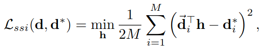
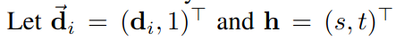

# Monodepth Estimation

## Prerequisites

- activate shared environment as before `conda activate dpt`
- if this does not work, create your own `conda env create -f environment_dpt.yml`
- create symlink to weights `ln -s /project/cv-ws2425/lmb/data/monodepth/dpt_large-midas-2f21e586.pt /project/cv-ws2425/<username>/cv-exercises/ex08_depth_estimation/weights/dpt_large-midas-2f21e586.pt`
- create symlink for input data
    - scannet: `ln -s /project/cv-ws2425/lmb/data/monodepth/test_images/scannet /project/cv-ws2425/<username>/cv-exercises/ex08_depth_estimation/input/scannet`
    - pix3d: `ln -s /project/cv-ws2425/lmb/data/monodepth/test_images/pix3d /project/cv-ws2425/<username>/cv-exercises/ex08_depth_estimation/input/pix3d`

## Task 1

- run the monodepth estimation on the example images
    `python run_monodepth.py -t dpt_large -i input/scannet -o output_monodepth/scannet`
- look at the png images and try to find mistakes from 2D depth
- use the script `visualize_pfm.py` to read the predictions and visualize the depth as 3D PointCloud
    1. check if you can identify the errors you found in 2D also in 3D 
    2. do new errors become visible in 3D?
    3. is there a general problem with the depth?

## Task 2

Monodepth estimation cannot rely on triangulation like the stereo methods we know from the previous exercises. It can use some shape cues, like shading to infer depth and it can learn rely on previously seen scene configurations, also called prior knowledge. This requires a lot of data. Some of this data is not in real world scale, like 3D-videos. Therefore DPT (the method that we are using) only makes predictions up to a scale and shift.
These scale and shift parameters can be recovered for nicer visualizations when we know the ground truth depth.

- On paper: solve for s,t from the alignment equation using linear least squares
    - Hint: see [yt](https://youtu.be/pKAPgUb4vL8?t=257)
    - Hint: see paper [MiDas-section4](https://arxiv.org/pdf/1907.01341v1.pdf), this also contains the solution h_opt
- implement the solution in `compute_scale_and_shift` in `visualize_pfm.py`
- apply s,t to the prediction and visualize it as pointcloud again

## Task 3 - usecases of depth

When we move past a scene, far away objects move slower in the image than objects close by.
With the depth we have the necessary information now, when we want to assemble new images.
One example for this is a new feature from facebook:
- [Facebooks 3D image](https://arxiv.org/pdf/2008.12298v1.pdf)
- Implement something similar to this without the inpainting part
    - estimate the depth with the monodepth network
    - backproject rgb and depth image and get the point cloud. This requires the camera intrinsics
    - rotate the pointcloud, i.e. create a new view
    - project the points back into the image
    - create a gif for multiple view points
- feel free to try out more things with depth, for example background removal for exposed objects
- run monodepth estimation on your own images
